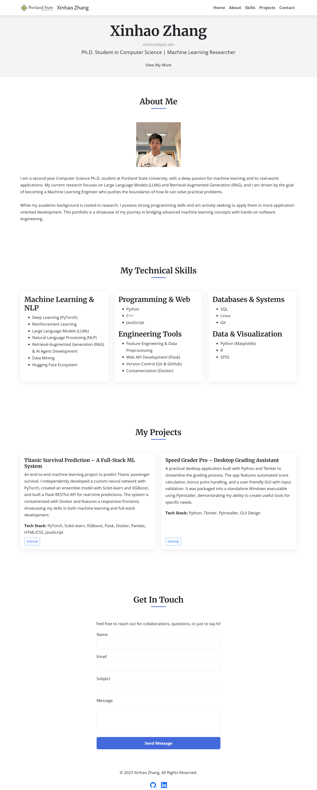
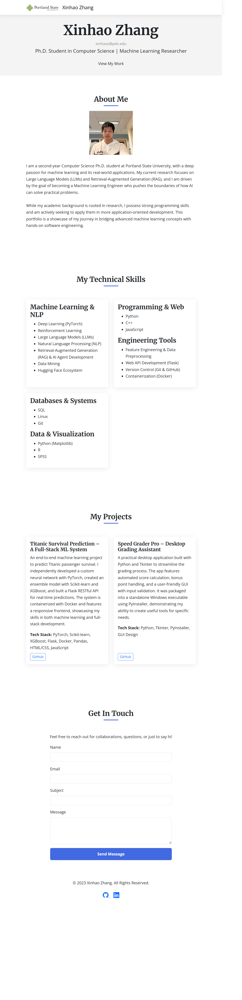
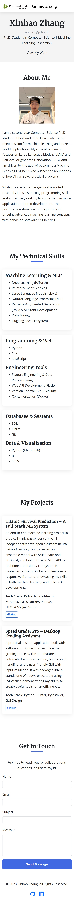

# Personal Portfolio Website

This is a fully responsive personal portfolio website built as the final project for the **CS-563-002: Intro To Web Development** course. The site showcases my professional profile, technical skills, and featured projects, all presented in a clean, modern, and accessible single-page layout.

---

## 🚀 Live Demo

The website is deployed using GitHub Pages and is available at:

**[https://xinhaozh23.github.io/web-final-project/](https://xinhaozh23.github.io/web-final-project/)**

---

## ✨ Key Features

*   **Fully Responsive Design:** The layout seamlessly adapts to all screen sizes, from mobile phones to large desktop displays, ensuring an optimal viewing experience for every visitor.
*   **Dynamic Navigation:** Implements Bootstrap's **Scrollspy** component, which automatically highlights the current section in the navigation bar as the user scrolls. This is paired with a custom JavaScript **smooth scrolling** effect for a fluid and intuitive user experience.
*   **Dynamic Content with GitHub API:** The "Projects" section dynamically fetches and displays real-time **star and fork counts** for my repositories by making asynchronous calls to the GitHub REST API, showcasing my ability to work with external data sources.
*   **Client-Side Form Validation:** The contact form includes robust, custom-built validation using JavaScript, providing immediate and user-friendly feedback without relying on native browser validation.
*   **Accessibility (a11y) Compliant:** The entire site was developed with accessibility in mind, passing automated checks to ensure it is usable by a wide range of audiences.

---

## 🛠️ Technology Stack

This project was built from the ground up using a modern front-end technology stack:

*   **Core Languages:** HTML5, CSS3, JavaScript (ES6+)
*   **Framework:** Bootstrap 5 (for grid system, components, and utilities)
*   **Fonts & Icons:**
    *   Google Fonts (Merriweather and Open Sans)
    *   Bootstrap Icons
*   **APIs:** GitHub REST API
*   **Development Tools:**
    *   Git & GitHub for version control
    *   Prettier for code formatting
*   **Deployment:** GitHub Pages

---

## 💻 Setup and Running Locally

To run this project on your local machine, please follow these steps:

1.  **Clone the repository:**
    ```bash
    git clone https://github.com/XinhaoZh23/web-final-project.git
    ```
2.  **Navigate to the project directory:**
    ```bash
    cd web-final-project
    ```
3.  **Open `index.html` in your web browser.**
    *   No complex build steps or installations are required. The site uses CDN links for all external libraries, so a simple file-opening in a browser is sufficient to run it.

---

## 🖼️ Screenshots

Here is a preview of the website on different devices:

## Responsive Page Showcase

**Large Screen (Desktop)**



**Medium Screen (Tablet)**



**Small Screen (Mobile)**



---

## 📚 External Resources

During the development of this project, a number of external resources were consulted for guidance and problem-solving. These include but are not limited to:

*   <https://blog.csdn.net/m0_74249162/article/details/138342161>
*   <https://blog.csdn.net/qq_63358859/article/details/131547957>
*   <https://blog.csdn.net/eahba/article/details/145898691>
*   <https://blog.csdn.net/m0_46612221/article/details/120876111>
*   <https://blog.csdn.net/a2868221132/article/details/129462602>